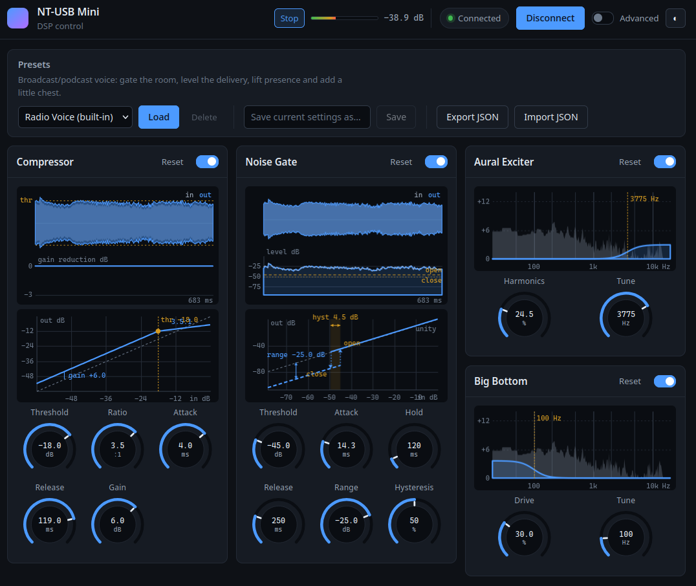

# rode-dsp

[](https://github.com/andymason/rode-nt-mini-dsp/actions/workflows/ci.yml)

Controls the Rode NT-USB Mini's built-in sound processing, on Linux and Windows.
A real-time web UI controls and configures the DSP filters, with live
visualisations of what every effect is doing.



## Description

The Rode NT-USB Mini processes sound inside the microphone, before it reaches
the computer. Four processors are available: a compressor, a noise gate, an aural
exciter and a big bottom.

The microphone holds these settings only while it has power. They are lost
whenever it is unplugged or the computer is shut down. rode-dsp saves the chosen
settings and sends them back whenever the microphone is detected: at startup, on
connection, and after resume.

RØDE's own application, [RØDE
Connect](https://rode.com/en/software/rode-connect), controls the same
processors but runs only on Windows and macOS. rode-dsp brings them to Linux,
and on Windows it is a lightweight alternative that needs no installation.

The tool was developed on Windows, where the USB captures, debugging and
testing were done, and then refined for Linux.

## Requirements

- A Rode NT-USB Mini.
- Linux, with systemd for the startup service, or 64-bit Windows.

## Installation

### Linux

Download `rode-dsp-linux-amd64` from the [latest
release](https://github.com/andymason/rode-nt-mini-dsp/releases/latest), or
`rode-dsp-linux-arm64` for an ARM machine such as a Raspberry Pi. Then, in the
download folder:

```
chmod +x rode-dsp-linux-amd64
sudo ./rode-dsp-linux-amd64 setup
rode-dsp gui
```

Setup asks for a password. The last command opens the settings page in a
browser; settings apply as they are changed, and are saved automatically.

To remove: `sudo rode-dsp setup --remove`. Saved settings are kept; delete
`~/.config/rode-dsp` to remove those too.

### Windows

Download `rode-dsp-windows-amd64.exe` from the [latest
release](https://github.com/andymason/rode-nt-mini-dsp/releases/latest). Then, in a
terminal in the download folder:

```
.\rode-dsp-windows-amd64.exe gui
```

Nothing needs installing: Windows can reach the microphone without any setup.
There is no startup service either, so after the microphone loses power, run
`rode-dsp load` to send the saved settings again. To remove, delete the program
and `%AppData%\rode-dsp`.

## Processors

| | |
|---|---|
| **Compressor** | Evens out loud and quiet passages. |
| **Noise gate** | Attenuates background sound between words. |
| **Aural exciter** | Adds upper harmonics for clarity. |
| **Big bottom** | Adds low-end weight. |

All are off by default and can be used alone or together. The settings page
shows a live level meter and a picture of what each processor is doing. One
preset, **Radio Voice**, is built in; others can be saved and shared.

The microphone has no volume control, equaliser, high-pass filter or de-esser.
The four processors above are everything it exposes.

## Usage

```
rode-dsp setup                          install, and reapply at startup
rode-dsp gui                            open the settings page
rode-dsp status                         report the microphone's current values
rode-dsp comp --enable --threshold -20  enable the compressor
rode-dsp gate --enable --attack 0.8     enable the noise gate
rode-dsp load                           send the saved settings again
rode-dsp defaults                       reset all values to their defaults
```

`rode-dsp <command> -help` lists that command's options.

`status` reads the microphone rather than the saved file, so it stays correct
after another program has changed something. `--config-only` reports the saved
values instead.

## Files

Nothing is written until a value is changed. Until then the microphone runs on
its own defaults.

| | |
|---|---|
| Linux/BSD | `$XDG_CONFIG_HOME/rode-dsp/` (usually `~/.config/rode-dsp/`) |
| Windows | `%AppData%\rode-dsp\` |
| macOS | `~/Library/Application Support/rode-dsp/` |

`config.json` holds the current settings, `presets.json` the saved presets.
`--config <path>` or `$RODE_DSP_CONFIG` selects a different file; `--config`
wins. `rode-dsp load --config <file>` applies a file from elsewhere.

The settings page binds to loopback only. It has no password, so access is
limited to this machine by design.

## What setup installs

`rode-dsp setup --dry-run` prints every file it would write, with contents, and
writes nothing.

| | |
|---|---|
| `/usr/local/bin` | the program |
| `/etc/udev/rules.d` | a rule granting access without `sudo`, and a trigger for the service |
| `/etc/systemd/system` | a service that sends the settings whenever the microphone appears |

The service reads the settings file in the installing user's home directory, so
a changed value takes effect at the next trigger with nothing to reinstall.
`--no-boot` skips the service; `--bin-dir`, `--udev-dir` and `--unit-dir` change
the locations above.

Distributions without `uaccess` (Alpine, Void, Gentoo/OpenRC) need the access
rule edited: replace `TAG+="uaccess"` with `GROUP="plugdev"` and join that
group. The service requires systemd, so use `--no-boot` there.

## Exit status

A missing microphone is reported separately from a failure, which is how the
service treats a switched-off microphone as normal.

| Code | Meaning |
|---|---|
| 0 | Applied |
| 1 | Failure — invalid settings, permission denied, protocol error |
| 2 | Microphone not connected |

`load --wait N` retries for up to N seconds, for a microphone that is slow to
appear.

## Troubleshooting

**Microphone not found.** Check that it is connected. If it is, unplug and
reconnect it: the access rule reaches only microphones connected after setup ran.

**Settings not restored after a restart.** Check the service with `systemctl
status rode-dsp`. It reports as skipped until a value has been set, because
there is nothing to send.

**No volume control.** The microphone has none. Use the system sound settings.

**Firmware 2.1.2 or older.** These need a different scale factor, which is not
implemented. Update with RØDE Central, or see
[`docs/protocol.md`](docs/protocol.md#firmware-212-and-older).

## Building from source

```
go build
go test ./...
```

cgo is required, because the USB library is C: a C toolchain must be present and
`CGO_ENABLED` must not be `0`. Cross-compiling therefore needs a cross
toolchain. On Windows, install a MinGW-w64 GCC (for example from
[MSYS2](https://www.msys2.org/)) and put it on `PATH`. Linux also needs the
libudev headers:

| Distribution | Package |
|---|---|
| Debian/Ubuntu | `apt install libudev-dev` |
| Fedora | `dnf install systemd-devel` |
| Arch | `pacman -S systemd` |
| openSUSE | `zypper install libudev-devel` |

`internal/protocol` and `internal/dsp` build without libudev, so the
correctness-critical tests run anywhere.

## Protocol notes

RØDE publish no specification, so the protocol was reverse engineered, for
interoperability, from USB captures of RØDE Connect and static analysis of the
application in Ghidra, with LLM agents driving Ghidra over MCP.
[`docs/protocol.md`](docs/protocol.md) describes the tools and method, the wire
protocol, the encoder and decoder formulas, and what remains unknown.
`internal/protocol/capture_oracle_test.go` tests the encoders against the USB
captures.

Two limits apply. Values quantise to the device's 256 steps, so a value read
back can differ from the one written by up to one step. Some arithmetic runs at
a different precision here than in RØDE Connect, differing by about one part in
2.4 million.

`tools/frida/` holds the instrumentation scripts. Three commands exist for that
work rather than daily use:

```
rode-dsp probe-effects    which effect IDs hold state
rode-dsp read-raw         probe HID report 0x03
rode-dsp send-raw --i-know-what-this-does <hex>
```

There is no equaliser, high-pass filter or de-esser on this microphone. RØDE
Connect contains panels for all three and hides them; the firmware has no
matching DSP blocks. [`docs/protocol.md`](docs/protocol.md#no-equaliser-high-pass-filter-or-de-esser)
has the evidence.

## Licence and trademarks

rode-dsp is released under the [MIT licence](LICENSE).

It is an independent, non-commercial project, and is not affiliated with,
endorsed by or supported by RØDE Microphones. RØDE, NT-USB Mini and RØDE
Connect are trademarks of their owner and are used here only to identify the
hardware and software this tool works with. No RØDE software, firmware or
source code is included in this repository.
